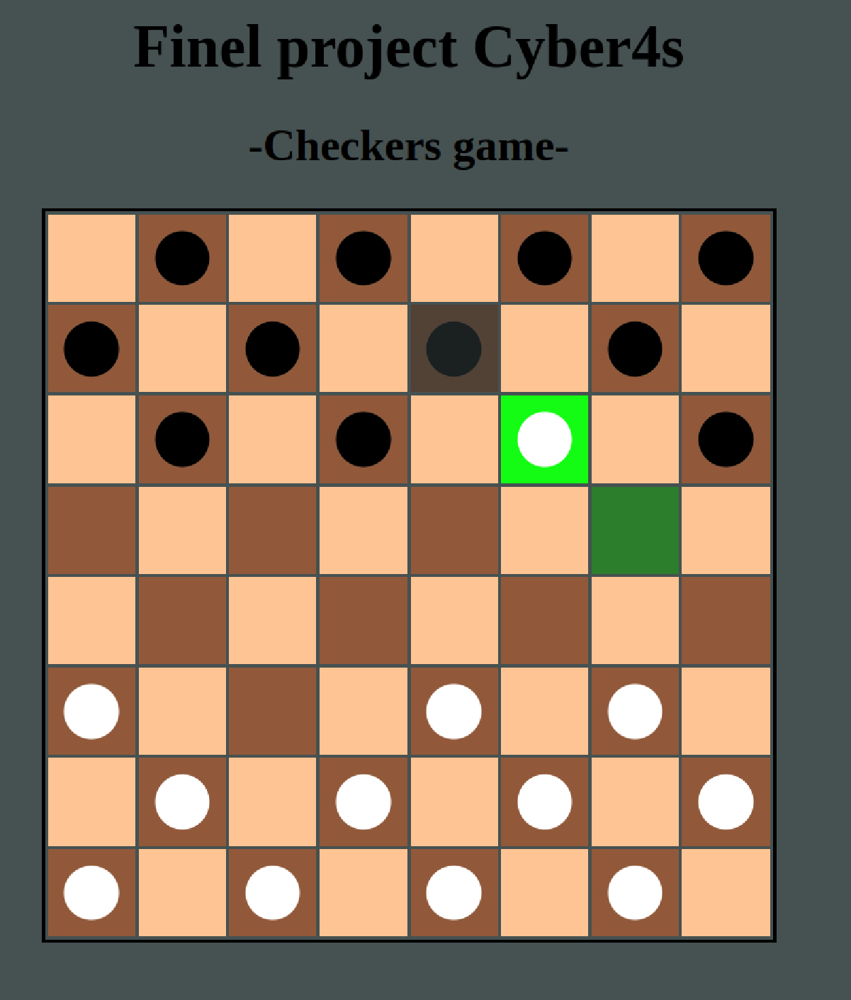

## About 

### [➡️ Open the app ⬅️](https://checkers-game-vanillaa.netlify.app/)

After a month in the bootcamp we were given an independent task - to create a checkers game.
After three intensive days, I finished the project and submitted it.

<b>Brief description of the Checkers game:</b>
```
1. Checkers is played on an 8X8 board.

2. Only the dark cells on the board are used.

3. Each player has 12 pieces, in 3 rows.

4. The object of the game is to capture all of your opponent’s checkers, or position your pieces so that your opponent cannot make another move.

5. Pieces move one space diagonally forward. Pieces cannot move backwards. If a jump is available, you must make the jump.

6. If there are multiple moves, the player can choose which one they want to take.

7. A piece can jump over the opponent’s piece, in order to capture them.

8. A piece cannot jump backwards. You do not need to support multiple 
jumps in one turn.

9. When a piece reaches the end of the board, it becomes a queen. Queens can move more than one cell. They can move forward and also backward. After a jump they land as if they were a regular piece. Subsequent jumps cannot move more than one cell.
```

<b> I was accepted to the bootcamp based on the project and a personal interview and started a new path.</b>




